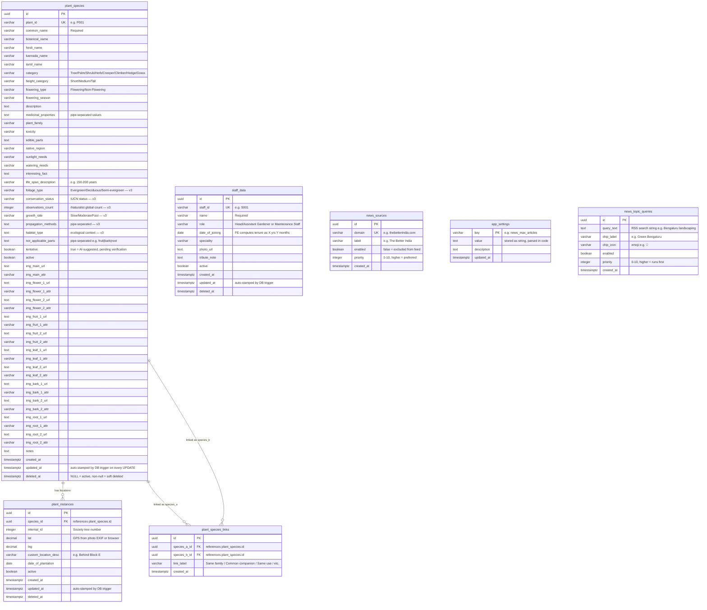

# Entity Relationship Diagram
## Elan Greens — Database Schema v3.0.0

> Rendered automatically by GitHub. Uses [Mermaid](https://mermaid.js.org/) syntax.

---

## Relationships Explained

| Relationship | Type | Meaning |
|---|---|---|
| `plant_species` → `plant_instances` | One-to-Many | One species (e.g. Neem) can exist at many physical locations. Soft-delete only — no cascade. |
| `plant_species` ↔ `plant_species_links` | Many-to-Many (self-join) | A species can be linked to multiple other species. One row covers both directions via `LEAST(species_a_id, species_b_id)` unique index. |
| `news_sources` | Standalone | Domain whitelist — no FK relationships. Compared against RSS-parsed article domains in `newsService.ts`. |
| `app_settings` | Standalone | Key-value store for algorithm tuneable knobs. Read once per `fetchPlantNews()` call. |
| `news_topic_queries` | Standalone | Each row generates one Google News RSS fetch in `newsService.ts`. |

---

## Key Design Decisions

| Decision | Rationale |
|---|---|
| Species and instances in separate tables | Avoids duplicating botanical data and images for every physical plant. 10 Neem trees = 10 instance rows, but images and descriptions stored once. |
| Soft delete via `deleted_at` | Deleted records are hidden from the public app but recoverable from admin. No permanent data loss. |
| `updated_at` via DB trigger | Guaranteed accurate regardless of which tool modifies the row — admin app, Supabase dashboard, or SQL editor. |
| `tentative` boolean | All AI-identified data starts as tentative. Admin removes the flag after manual verification. |
| RLS at DB layer | Public anon key can only read `active = true AND deleted_at IS NULL`. Write access requires service_role key, kept server-side only. |
| `not_applicable_parts` field | Reusable across grasses, some creepers, and other species where certain image categories do not apply. Stored pipe-separated, parsed by the app. |
| `plant_species_links` bidirectional via `LEAST/GREATEST` | Single row covers A→B and B→A. Unique constraint on `(LEAST(a,b), GREATEST(a,b))` prevents duplicate links. Queries must use `OR` on both columns. |
| News configuration in DB (not code) | `news_sources`, `app_settings`, `news_topic_queries` are all admin-editable via the Settings page. No code changes or deployment needed to add a source or tweak a knob. |
| `news_sources` fallback hardcoded in `newsService.ts` | If the table is empty (e.g. migration not yet run), a hardcoded fallback list of 10 trusted domains is used so the feed still works. |

---

## Schema Version History

| Version | Date | Changes |
|---|---|---|
| v1.0.0 | April 2026 | `plant_species`, `plant_instances`, `staff_data` |
| v3.0.0 | May 2026 | Added 6 enrichment columns to `plant_species`. Added `plant_species_links`, `news_sources`, `app_settings`, `news_topic_queries`. |
