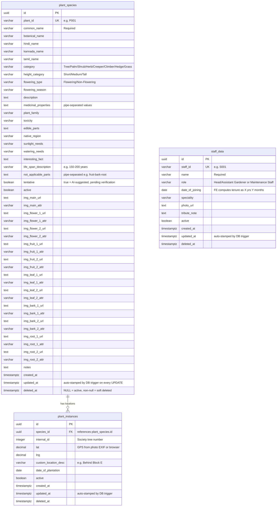

# Entity Relationship Diagram
## Elan Greens — Database Schema v1.0.0

> Rendered automatically by GitHub. Uses [Mermaid](https://mermaid.js.org/) syntax.

---

## Relationship Explained

| Relationship | Type | Meaning |
|---|---|---|
| `plant_species` to `plant_instances` | One-to-Many | One species (e.g. Neem) can exist at many physical locations in the society. Deleting a species is blocked (`ON DELETE RESTRICT`) if instances exist. |

---

## Key Design Decisions

| Decision | Rationale |
|---|---|
| Species and instances in separate tables | Avoids duplicating botanical data and images for every physical plant. 10 Neem trees = 10 instance rows, but images and descriptions stored once. |
| Soft delete via `deleted_at` | Deleted records are hidden from the public app but recoverable from admin. No permanent data loss in v1. |
| `updated_at` via DB trigger | Guaranteed accurate regardless of which tool modifies the row — admin app, Supabase dashboard, or SQL editor. |
| `tentative` boolean | All AI-identified data starts as tentative. Admin removes the flag after manual verification. |
| RLS at DB layer | Public anon key can only read `active = true AND deleted_at IS NULL`. Write access requires service_role key, kept server-side only. |
| `not_applicable_parts` field | Reusable across grasses, some creepers, and other species where certain image categories do not apply. Stored pipe-separated, parsed by the app. |
